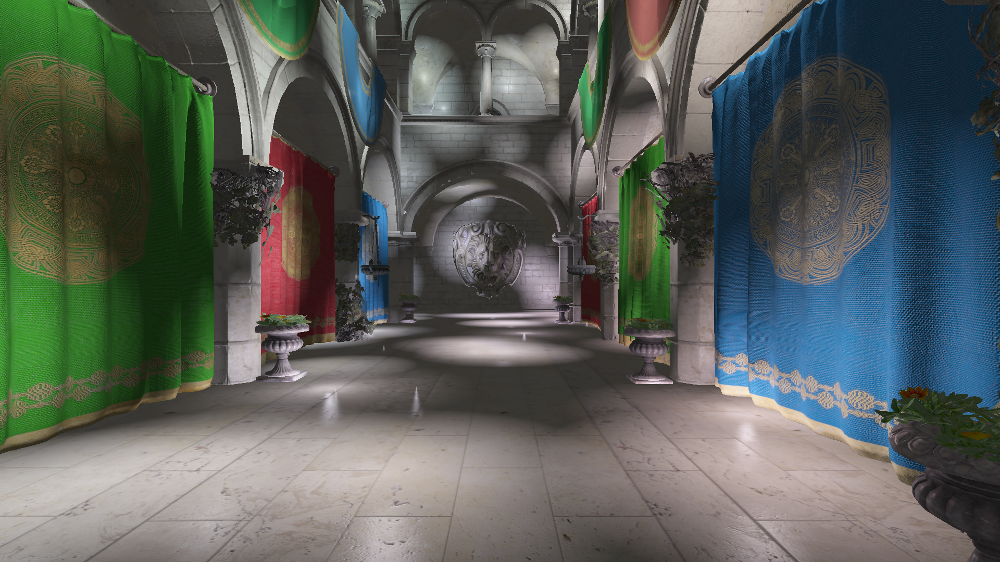
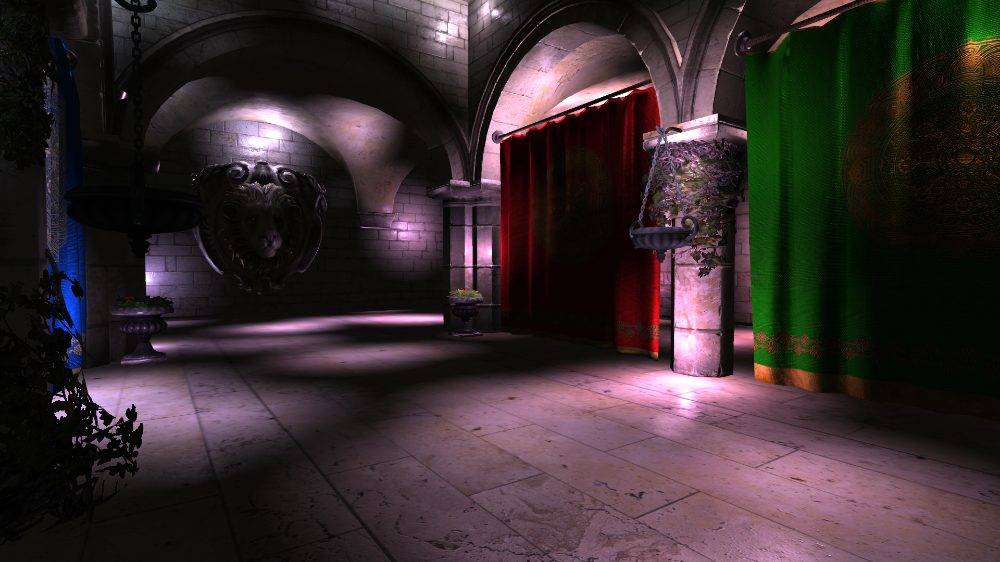
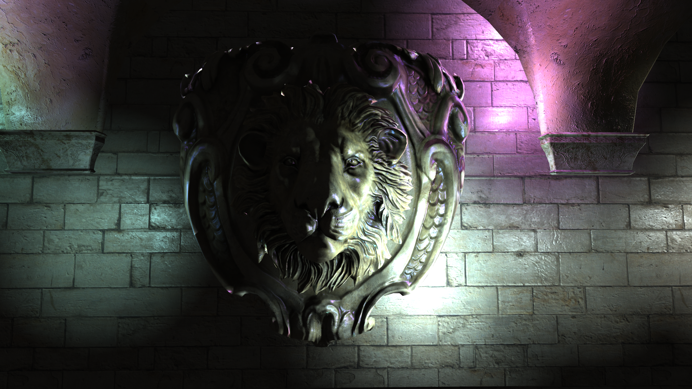
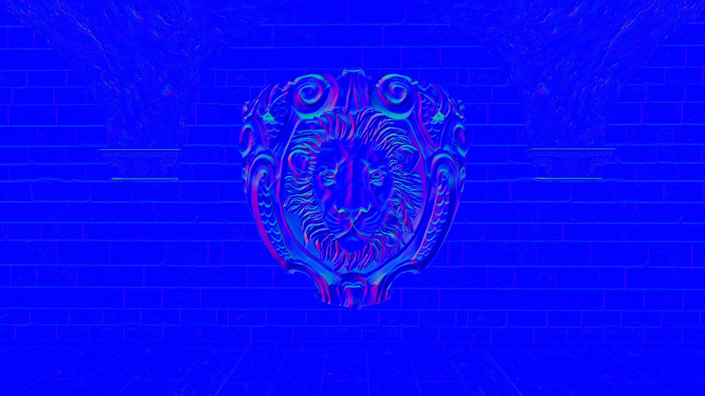
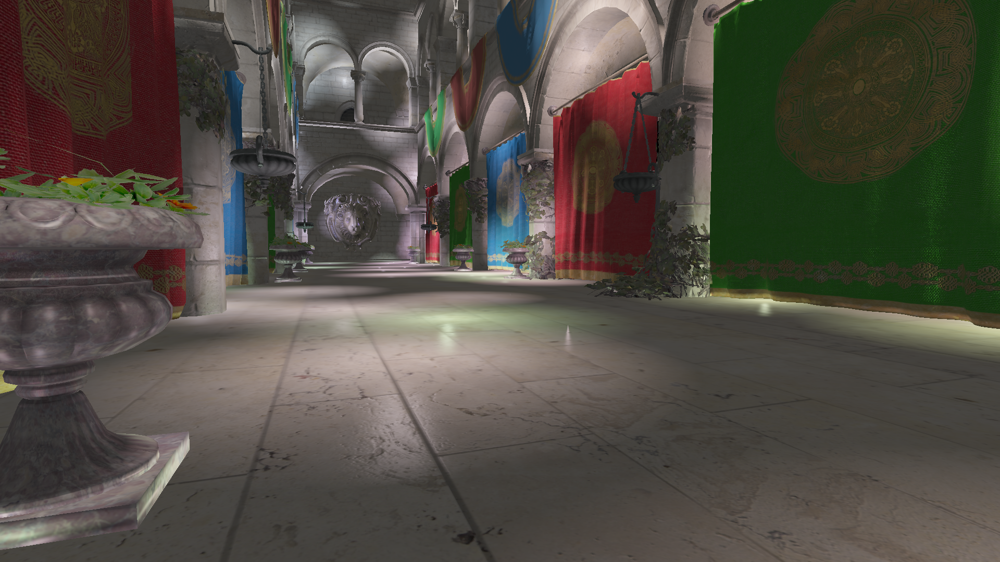
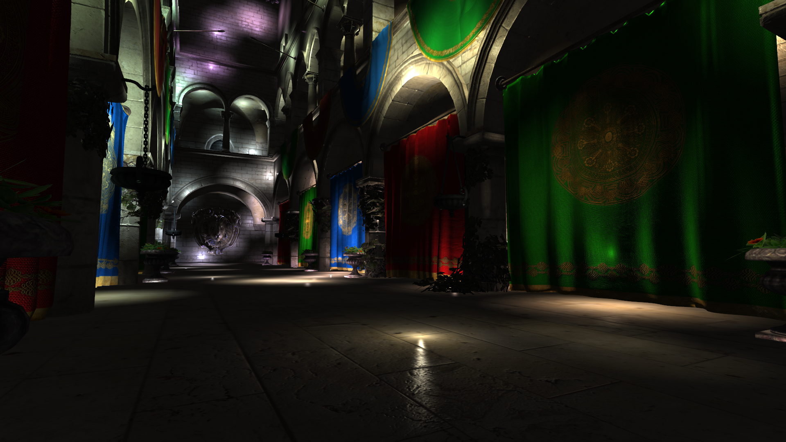
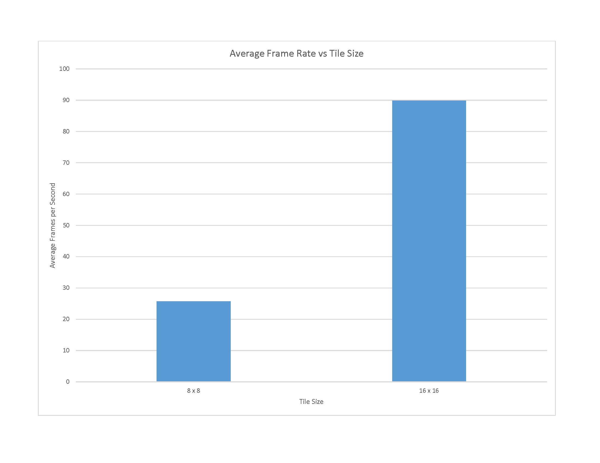

Forward+ Renderer
================

**University of Pennsylvania, CIS 565: GPU Programming and Architecture, Final Project**

* Bradley Crusco
 * [Personal Site](http://www.bradleycrusco.com)
 * [LinkedIn](https://linkedin.com/in/bcrusco)
* Megan Moore
 * [Personal Site](http://momeg0.wix.com/meganemoore)
 * [LinkedIn](https://linkedin.com/in/megan-moore-386076a6)
* Tested on: Windows 10, i7-3770K @ 3.50GHz 16GB, GTX 980 4096MB (Personal Computer)

## Description

A real-time GPU-based Forward+ renderer based on the paper [Forward+: Bringing Deferred Rendering to the Next Level](https://takahiroharada.files.wordpress.com/2015/04/forward_plus.pdf) by Takahiro Harada, Jay McKee, and Jason C. Yang.

## Video Demo

## Overview

There are three main steps in our renderer: depth prepass, light culling, and the light accumulation and final shading.

### Depth Prepass

In the depth prepass, we write the depth values of the scene from the camera's perspective into a depth buffer. The above image shows this buffer. Objects that are closer to the camera will appear darker, while objects far away will appear increasingly white. The above debug view can be generating by compiling and running the renderer while including `#define DEPTH_DEBUG` in main.h. Note: Because we are creating the depth buffer using the camera's projection, we must linearize the depth values to get the proper results. Without doing this, the depth values will be heavily weighted to the nearest portion of the projection.

### Light Culling

.png "Lights per Tile (1024 Lights, Radius = 50, Tile Size = 16 x 16)")

The defining stage of the renderer is the light culling stage. Here, we split the screen into tiles, each 16 x 16 pixels in our implementation, and determine what lights are visible in each tile. We use a compute shader (available in OpenGL 4.3) to calculate which lights are visible. There are two implementations of this technique described in the paper, gather and scatter. We chose the gather approach.

The stage works as follows. A work group is created for each tile. Within that work group, there are 256 threads, one for each pixel in the tile (16 * 16). The depth buffer we created in the depth prepass step is used to determine the minimum and maximum depth values within a tile. Each thread in the work group compares there respective minimum and maximum depths at their specific pixel using atomic operations, and the result is the minimum and maximum depths across the entire tile. Once this is done, one thread in the group calculates the frustum planes for that tile, which is then used by all threads in the work group.

We then change the parallelism of the threads to be parallelized around the lights as opposed to the pixels. We can then calculate whether or not a light is inside the frustum up to 256 lights in parallel. If there are additional lights in the scene (our supported maximum is currently 1024), additional passes of 256 parallel checks will occur until all the possible lights have been identified.

The final step is to output our local shared array of visible light indices confirmed to be valid for our tile, and write them to a shader storage buffer object that contains the visible indices for every tile in the scene. Currently only one thread is responsible for transferring this data to the shader storage buffer object, and we see this as an area for continued improvement.

A debug view of how many lights are in each tile is also provided. In order to view this, add the line `#define LIGHT_DEBUG` to main.h and compile and run the renderer. The more lights there are in a tile, the lighter it will be.  If there are no lights in a tile, it will be black. You can see an example of this view in the image above. This shows a scene with 1024 lights, each with a radius of 50, and a tile size of 16 x 16.

A more in-depth analysis on performance related to light culling and tile size can be found below.

### Light Accumulation and Final Shading

The final step is a shader that accumulates all the light contributions from the lists of visible lights we calculated per tile, and then does the final shading calculations. For each fragment, we determine which tile it belongs to, and loop through the indices stored at that tile's location in the shader storage buffer object of visible light indices. We are currently using the Blinn-Phong lighting model, but plan to make some changes here and implement different material properties to improve our render quality. We load diffuse and specular maps to define the colors of the diffuse and specular components, and use normal maps (more on that below).

## Features

### Tangent Space Normal Mapping

#### Lion Sculpture Featuring Normal Maps

#### Visualization of Lion Sculpture's Normals

We implemented normal maps in an effort to get better visual fidelity from our scene without to much additional computational cost. Crytek's Sponza model that we are using provided normal maps for most of the objects in the scene, and we created additional ones using Photoshop from the provided diffuse texture maps. We implemented the normal maps using tangent space normal mapping as an optimization over the basic implementation. In this method we express all the normals in our normal map in tangent space, where the vectors point roughly along the positive z direction. We then transform all of our lighting vectors to this coordinate space. This allows us to always use the same normal map regardless of the object's orientation. Above you can see an example of the use of normal maps in our scene.

### High Dynamic Range Lighting using Reinhard Tone Mapping

#### Sponza Scene Rendered with HDR

#### Sponza Scene Rendered without HDR

Adding high dynamic range lighting (HDR) to our renderer was a relatively simple task with huge benefits in image quality for our scene. Typically brightness and color values are clamped between the range of 0.0 and 1.0 when stored in the framebuffer. Our scene features many lights that are constantly overlapping, and we are frequently accumulating color values over 1.0 in our accumulation shading step. Since the framebuffer caps these values at 1.0, we lose all the intensity of those lights. For HDR we render our scene into a floating point framebuffer, which doesn't clamp our color range. Then, in a new HDR shader program, we perform Reinhard tone mapping, which converts the unbounded color variables back to a range of 0.0 - 1.0 which the computer display requires, but in a way that retains the detail we captured in the floating point framebuffer.

## Performance Analysis

### Forward+ vs. Forward Rendering Frame Rate

In the a traditional forward renderer, for each fragment we calculate the light contribution from each light in the scene. This is essentially like the culling stage of our Forward+ renderer failing to cull any lights from any of the tiles. We see a massive performance gain when using the Forward+ technique vs. the Forward one. With 1024 lights in the scene (our maximum), a light radius of 10, tile size of 16 pixels squared, and 1080p resolution, we were able to achieve an average frame rate of 89.867 frames per second over our 60 second benchmark. Rendering the same scene under the same conditions, Forward rendering only achieved an average of 1.7 frames per second. Below are two videos, one for the Forward renderer and the other for the Forward+, running our benchmark. The Forward+ is able to handle rendering the scene with ease, while the Forward renderer resembles a slide show.

#### Forward vs. Forward+ Rendering Frame Rate

#### Forward Rendering Benchmark (1024 Lights)

#### Forward+ Rendering Benchmark (1024 Lights)

### Tile Size

We experimented with multiple different tile sizes before we landed on 16 x 16 pixel tiles. The most promising candidate was 8 x 8 tiles, and this was also the first size we tried, as it is the size used in the Forward+: Bringing Deferred Lighting to the Next Level paper. With 8 x 8, we achieved an average frame rate of 25.7 frames per second. Once we switched to 16 x 16 pixel tiles, our average jumped to 89.86. You can see those results in the chart below. Below that chart you can see various debug images for different tile dimensions and light sizes. These are the light count debug images. The lighter the tile in the image, the more lights occupy its bounding frustum. The first thing that's clear from these images is the effect of the light radius. At a reasonable light radius of 30, we have a very dark image, and there are very few lights per tile, making our algorithm very efficient at rendering this type of scene. For much larger lights, with a radius of say 50, the Forward+ culling begins to reduce in effectiveness. These these images are much brighter, indicating many more lights per tile than the previous example.

If you look closely at both sets of images you can see the differences between the tile sizes. The 8 x 8 tiles give a more accurate representation of the lighting locations than its 16 x 16 counterpart. However, the additional calculations in the compute shader for the increased number of tiles, among other things, results in diminishing returns. 16 x 16 is by far the best tile size for our scene.

#### Average Frame Rate vs. Tile Size

#### Lights per Tile (1024 Lights, Radius = 30, Tile Size: 8 x 8)

.png "Lights per Tile (1024 Lights, Radius = 30, Tile Size = 8 x 8)")

#### Lights per Tile (1024 Lights, Radius = 30, Tile Size: 16 x 16)

.png "Lights per Tile (1024 Lights, Radius = 30, Tile Size = 16 x 16)")

#### Lights per Tile (1024 Lights, Radius = 50, Tile Size: 8 x 8)

.png "Lights per Tile (1024 Lights, Radius = 50, Tile Size = 8 x 8)")

#### Lights per Tile (1024 Lights, Radius = 50, Tile Size: 16 x 16)

.png "Lights per Tile (1024 Lights, Radius = 50, Tile Size = 16 x 16)")

## Future Work

We had a lot of fun working on this project and are really excited with the results we achieved. Because of the time constraints of the project we were forced to focus all of our attention on the main implementation of the Forward+ technique. We think there's a lot more that could be done to improve the quality and performance of the renderer, and we have lots of plans for future development.

* Directional lights
* Material properties
* Stenciled shadow volumes for point lights
* SSAO
* Gamma correction
* Cascading shadow maps
* Skybox and environment mapping
* Improved normal mapping techniques
* Bloom
* Visual representations of the point lights in the scene
* Additional performance analysis and optimization

## Build Instructions

Coming soon.

## Interactive Controls

Controlling the camera and moving about the scene will be intuitive to anyone whose played a first-person shooter game.
* W: Move forward.
* A: Move left.
* S: Move backward.
* D: More right.
* Mouse movement: Orients the camera.

## Acknowledgments
* [Forward+: Bringing Deferred Rendering to the Next Level](https://takahiroharada.files.wordpress.com/2015/04/forward_plus.pdf)
 * Takahiro Harada, Jay McKee, and Jason C. Yang
 * [EUROGRAPHICS 2012 Slide Deck](http://www.slideshare.net/takahiroharada/forward-34779335)
* [DirectX 11 Rendering in Battlefield 3](http://www.dice.se/news/directx-11-rendering-battlefield-3/)
 * Johan Andersson
 * Helpful in resolving some of the light culling implementation details.
* [Learn OpenGL](http://www.learnopengl.com/)
 * Joey de Vries
 * Helped with clarification on OpenGL implementation details and basis for our model loader.
 * Thanks to [Debanshu Singh](https://www.linkedin.com/in/debanshu) for introducing this to us.
* [Crytek's Sponza Model](http://www.crytek.com/cryengine/cryengine3/downloads)
 * Frank Meinl
 * Have made changes to remove certain parts of the scene, create additional normal and specular maps, etc.

## Libraries
* [Assimp: Open Asset Import Library](http://www.assimp.org/)
 * Used to load our assets into the renderer.
* [DevIL: Developer's Image Library](http://openil.sourceforge.net/)
 * Used for loading images for textures.
* [GLM: OpenGL Mathematics](http://glm.g-truc.net/0.9.7/index.html)
* [GLFW](http://www.glfw.org/)
* [GLEW: The OpenGL Extension Wrangler Library](https://github.com/nigels-com/glew)
